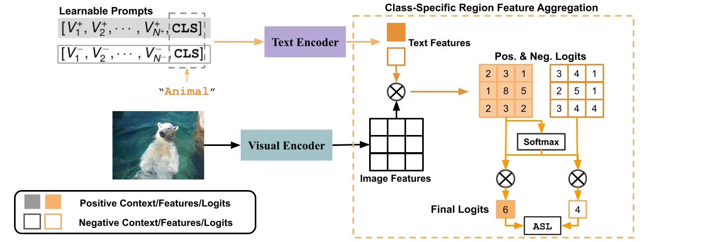

# DualCoOp: Fast Adaptation to Multi-Label Recognition with Limited Annotations (NeurIPS 2022)
Authors: [Ximeng Sun](https://cs-people.bu.edu/sunxm/), [Ping Hu](https://cs-people.bu.edu/pinghu/homepage.html), [Kate Saenko](http://ai.bu.edu/ksaenko.html)

## Introduction


In this work, we utilize the strong alignment of textual and visual
features pretrained with millions of auxiliary image-text pairs and propose Dual
Context Optimization (DualCoOp) as a unified framework for partial-label MLR and
zero-shot MLR. DualCoOp encodes positive and negative contexts with class names
as part of the linguistic input (i.e. prompts). Since DualCoOp only introduces a very
light learnable overhead upon the pretrained vision-language framework, it can
quickly adapt to multi-label recognition tasks that have limited annotations and even
unseen classes. Experiments on standard multi-label recognition benchmarks across
two challenging low-label settings demonstrate the advantages of our approach over
state-of-the-art methods. 

Links: [Arxiv](https://arxiv.org/abs/2206.09541)/[Poster](https://drive.google.com/file/d/1eReJS8YJ1qkQHTmcjLQYCEYtA4z0Ba_d/view?usp=sharing)/[Slides](https://docs.google.com/presentation/d/14zkppeqQxNTHaBx7ud4PhmTs09bxKd8U/edit?usp=sharing&ouid=115960956800492598069&rtpof=true&sd=true)

Welcome to cite our work if you find it is helpful to your research.
```
@inproceedings{
sun2022dualcoop,
title={DualCoOp: Fast Adaptation to Multi-Label Recognition with Limited Annotations},
author={Ximeng Sun and Ping Hu and Kate Saenko},
booktitle={Advances in Neural Information Processing Systems},
editor={Alice H. Oh and Alekh Agarwal and Danielle Belgrave and Kyunghyun Cho},
year={2022},
url={https://openreview.net/forum?id=QnajmHkhegH}
}
```

## Set-up Experiment Environment
Our implementation is in Pytorch with python 3.9. 

Use `conda env create -f environment.yml` to create the conda environment.
In the conda environment, install `pycocotools` and `randaugment` with pip:
```
pip install pycocotools
pip install randaugment
```
And follow [the link](https://github.com/KaiyangZhou/Dassl.pytorch) to install `dassl`.

## Datasets
### Multi-Label Recognition with Patial Labels
- **MS-COCO**: We use the official `train2014`(82K images) and `val2014`(40K images) for training and test.
- **VOC2007**: We use the official `trainval` (5K images) and `test`
(5K images) splits for training and test. 
### Zero-shot Multi-Label Recognition
- **MS-COCO**: We follow [1, 2] to split the dataset into
48 seen classes and 17 unseen classes. We provide the json files of the seen and unseen annotations on [Google Drive](https://drive.google.com/file/d/154dkD7Ok1xxwTZb7hQTAf3FlNCN8Q6KM/view?usp=sharing). Download and move all files into `<coco_dataroot>/annotations/` for using in the training and inference.
- **NUS-WIDE**: Following [2, 3] we use 81 human-annotated categories as unseen classes and an additional set of 925 labels
obtained from Flickr tags as seen classes. We provide the class split on [Google Drive](https://drive.google.com/file/d/17pt25ed0qPvjjidVa_goAuH9PnS2lIfs/view?usp=sharing). Download and move those folders  into `<nus_wide_dataroot>/annotations/` for using in the training and inference.

## Training 
### MLR with Partial Labels
Use the following code to learn a model for MLR with Partial Labels
```
python train.py  --config_file configs/models/rn101_ep50.yaml \
--datadir <your_dataset_path> --dataset_config_file configs/datasets/<dataset>.yaml \
--input_size 448 --lr <lr_value>   --loss_w <loss_weight> \
-pp <porition_of_avail_label> --csc
```
Some Args:  
- `dataset_config_file`: currently the code supports `configs/datasets/coco.yaml` and `configs/datasets/voc2007.yaml`  
- `lr`: `0.001` for VOC2007 and `0.002` for MS-COCO.
- `pp`: from 0 to 1. It specifies the portion of labels are available during the training.
- `loss_w`: to balance the loss scale with different `pp`. We use larger `loss_w` for smaller `pp`.
- `csc`: specify if you want to use class-specific prompts. We suggest to use class-agnostic prompts when `pp` is very small.   
Please refer to `opts.py` for the full argument list.
For Example:
```
python train.py  --config_file configs/models/rn101_ep50.yaml \
 --datadir  ../datasets/mscoco_2014/ --dataset_config_file configs/datasets/coco.yaml \
 --input_size 448  --lr 0.002   --loss_w 0.03  -pp 0.5
```

### Zero-Shot MLR
```
python train_zsl.py  --config_file configs/models/rn50_ep50.yaml  \
--datadir <your_dataset_path> --dataset_config_file configs/datasets/<dataset>>.yaml \ 
--input_size 224  --lr <lr_value>   --loss_w 0.01  --n_ctx_pos 64 --n_ctx_neg 64 \
--num_train_cls <some_value_or_not_specified>
```
Some Args:  
- `lr`: 0.002 for MS-COCO and 0.001 for NUS-WIDE
- `n_ctx_pos`: the length of learnable positive prompt template
- `n_ctx_neg`: the length of learnable negative prompt template
- `num_train_cls`: set as an int `n`. The algorithm randomly pick `n` classes to compute ASL loss when the number of seen classes are very large during the training, *e.g.* NUS-WIDE 

Note that `csc` does not work for zero-shot MLR since some classes are never seen during the training.

For example:
```
python train_zsl.py --config_file configs/models/rn50_ep50.yaml  \
--datadir ../datasets/mscoco_2014/ --dataset_config_file configs/datasets/coco.yaml \
--input_size 224 --lr 0.002  --loss_w 0.01  --n_ctx_pos 64 --n_ctx_neg 64 
```

## Evaluation / Inference
### MLR with Partial Labels
```
python val.py --config_file configs/models/rn101_ep50.yaml \
--datadir <your_dataset_path> --dataset_config_file configs/datasets/<dataset>>.yaml \
--input_size 224  --pretrained <ckpt_path> --csc
```

### Zero-Shot MLR
```
python val_zsl.py --config_file configs/models/rn50_ep50.yaml \
--datadir <your_dataset_path> --dataset_config_file configs/datasets/<dataset>>.yaml \
--input_size 224  --n_ctx_pos 64 --n_ctx_neg 64 --pretrained <ckpt_path> --top_k 5
```

## Reference
[1] Ankan Bansal, Karan Sikka, Gaurav Sharma, Rama Chellappa, and Ajay Divakaran. Zero-shot object
detection. In ECCV, 2018.  
[2] Avi Ben-Cohen, Nadav Zamir, Emanuel Ben-Baruch, Itamar Friedman, and Lihi Zelnik-Manor. Semantic
diversity learning for zero-shot multi-label classification. In ICCV, 2021.  
[3] Dat Huynh and Ehsan Elhamifar. A shared multi-attention framework for multi-label zero-shot learning.
In CVPR, 2020.


## Acknowledgement
We would like to thank Kaiyang Zhou for providing code for [CoOp](https://github.com/KaiyangZhou/CoOp). We borrowed and refactored a large portion of his code in the implementation of our work.